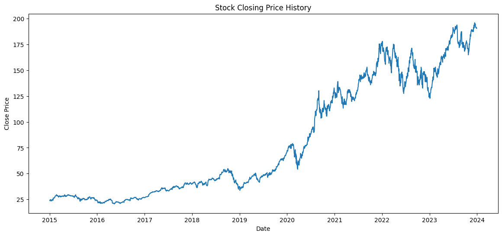
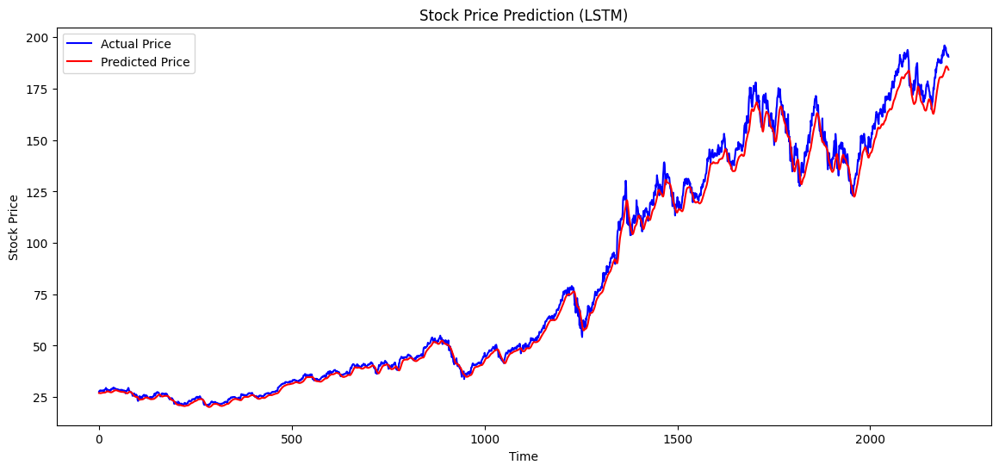

# 📈 Stock Price Trend Prediction using LSTM

## 📌 Project Overview
This project predicts **stock price trends** using a **Long Short-Term Memory (LSTM)** deep learning model.  
The model learns patterns from historical stock price data and predicts future prices based on past trends.

Stock market data is a **time series dataset**, making LSTM networks particularly effective because they can learn **long-term dependencies in sequential data**.

---

## 🎯 Objective

The goal of this project is to:

- Analyze historical stock price data
- Train an **LSTM neural network**
- Predict future stock prices
- Visualize **actual vs predicted trends**
- Understand stock movement using **technical indicators**

---

## 🛠 Tools & Technologies Used

- Python 🐍
- NumPy
- Pandas
- Matplotlib
- Scikit-learn
- TensorFlow / Keras
- Yahoo Finance API (yfinance)

---

## 📊 Dataset

Stock price data was downloaded using the **Yahoo Finance API**.

Features available in the dataset:

- Open
- High
- Low
- Close
- Adjusted Close
- Volume

For prediction, the **Closing Price** was used.

**Time Period Used:**  
2015 – 2024

---

## ⚙️ Steps Involved in Building the Project

### 1️⃣ Data Collection
Historical stock data was fetched using the **yfinance** library.

### 2️⃣ Data Visualization
The closing price history was plotted to observe the stock trend.

### 3️⃣ Data Preprocessing
- Selected closing price
- Normalized values using **MinMaxScaler**
- Converted data into sequences

### 4️⃣ Sequence Creation
The model uses:

**Previous 60 days of stock prices → Predict the next day price**

### 5️⃣ Building the LSTM Model
A deep learning model was built using:

- LSTM layers
- Dropout layers
- Dense output layer

### 6️⃣ Model Training
The model was trained using:

- Optimizer: **Adam**
- Loss Function: **Mean Squared Error**
- Epochs: **20**

### 7️⃣ Stock Price Prediction
The trained model predicts stock prices based on historical trends.

### 8️⃣ Visualization of Results
Actual prices and predicted prices were plotted to evaluate model performance.

### 9️⃣ Technical Indicators
Moving averages were added to analyze stock trends:

- 20-Day Moving Average
- 50-Day Moving Average

---

## 📉 Results

The LSTM model successfully learned patterns from historical stock data.

The **predicted prices closely follow the actual prices**, showing that the model captures the overall trend of the stock.

The visualization clearly demonstrates how the LSTM model tracks stock price movement.

---

## 📊 Stock Price History

This graph shows the historical closing price of the stock over time.



---

## 📉 Actual vs Predicted Stock Prices

This graph compares the **actual stock prices** with the **prices predicted by the LSTM model**.



---

## 📁 Project Structure

```
Stock-Price-Trend-Prediction-LSTM
│
├── assets
│   ├── stock_price_history_graph.png
│   └── actual_vs_predicted_graph.png
│
├── Stock_Price_Prediction.ipynb
├── stock_price_predictions.csv
├── lstm_stock_model.h5
├──requirments.txt
└── README.md
```

---

## 🚀 Future Improvements

Possible improvements for this project:

- Add more technical indicators (RSI, MACD)
- Predict multiple days ahead
- Use multiple stock features
- Build an interactive **Streamlit dashboard**
- Implement real-time stock prediction

---

## 📌 Conclusion

This project demonstrates how **Deep Learning and LSTM networks** can be applied to financial time-series data to predict stock price trends.

It highlights the potential of AI in **financial forecasting and market analysis**.

---

## 👨‍💻 Author

**Vidit Kumar**

AI & Machine Learning Enthusiast  
Passionate about NLP, Web Development, and AI Systems

- 📧 Email: vidit.kumar624@gmail.com  
- 🔗 LinkedIn: https://linkedin.com/in/viditkumar-in  
- 💻 GitHub: https://github.com/Vidit3859

---

⭐ If you found this project useful, consider giving it a **star on GitHub!**

---
